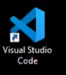
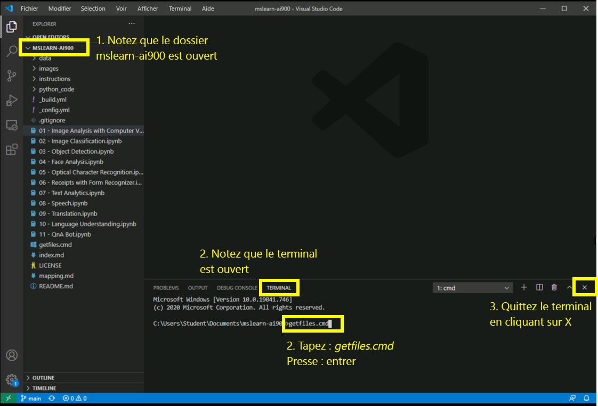

# Labos AI-900
## Utilisation de Visual Studio Code

1.  Démarrez Visual Studio Code (l’icône du programme est épinglée sur la barre des tâches inférieure). Lorsqu’il s’ouvre,  le projet MSLEARN-AI900 s’affiche sur le panneau de gauche.
2.  Nous allons extraire la dernière version du projet. Dans le terminal ouvert, saisissez +++getfiles.cmd+++ et appuyez sur **Entrée**. Cette commande extrait la dernière version du projet dans votre dossier. 
3.  Une fois la commande exécutée, vous pouvez fermer le panneau du terminal. Vous pouvez maintenant commencer le labo. 

